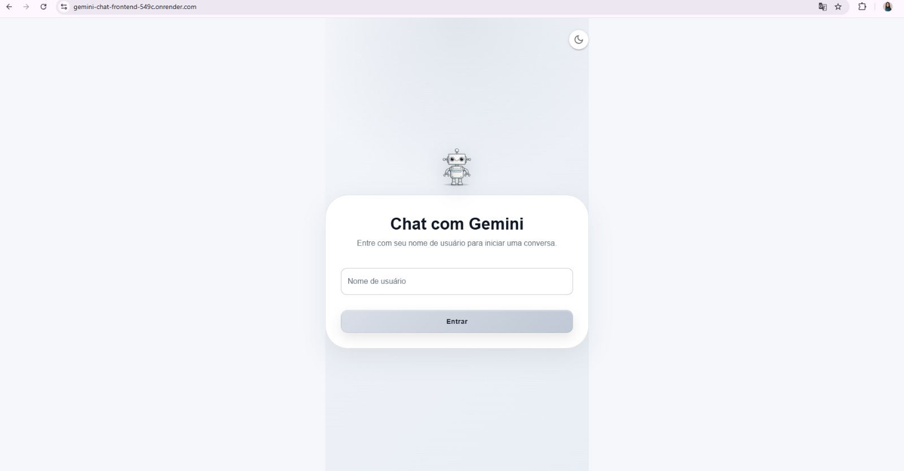
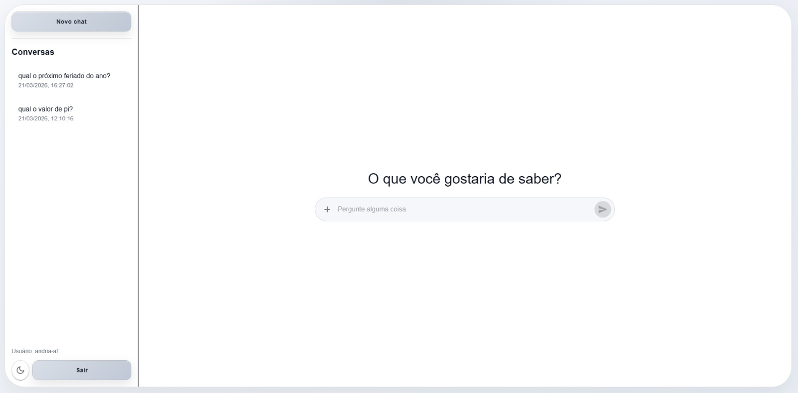
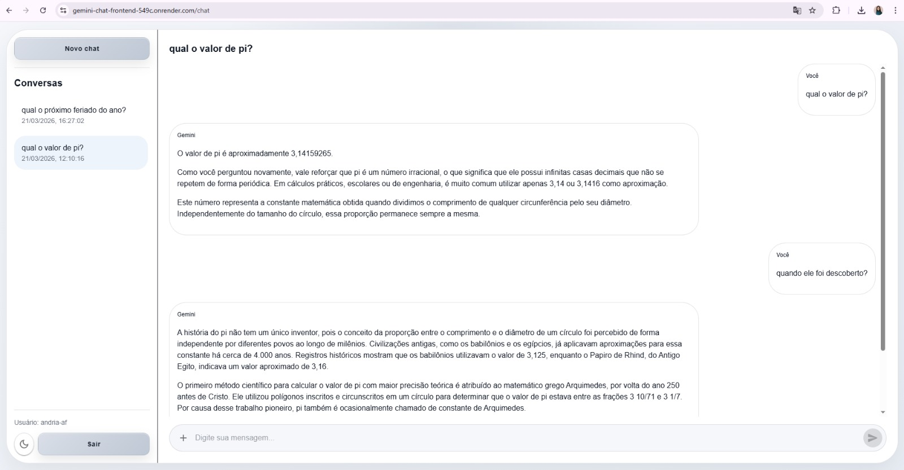
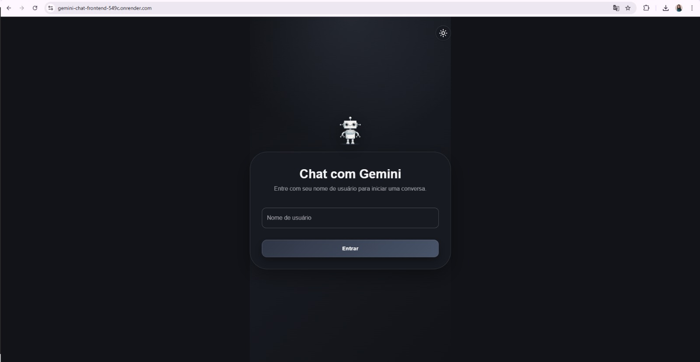

# 🤖 Gemini Chat — Frontend

Interface web desenvolvida em **React** com as atividades:

- login simples por username
- criação e listagem de conversas
- envio de mensagens
- exibição de respostas da IA (Gemini)
- atualização em tempo real via WebSocket
- tema claro/escuro
- feedback visual de loading e erros

## Tecnologias:

- React (Vite)
- TypeScript
- MUI (Material UI)
- Axios
- Socket.IO Client

### Deploy Render: https://gemini-chat-frontend-549c.onrender.com

### Instalação

## Requisitos

- Node.js **20.19+** ou **22.12+**
- npm **10+**

```bash
nvm install 22.13.0
nvm use 22.13.0
```

```bash
npm install
```

### Variáveis de ambiente

Crie um arquivo .env:

```bash
VITE_API_URL=http://localhost:3000
VITE_SOCKET_URL=http://localhost:3000
```

▶️ Como rodar o projeto local:

```bash
npm run dev
```

### Build produção

```bash
npm run build
npm run preview
```

### Funcionalidades

- autenticação simples integrada ao backend
- gerenciamento de conversas
- envio e recebimento de mensagens com IA
- atualização em tempo real (WebSocket)
- indicador de digitação da IA
- persistência de histórico
- interface responsiva

### Observações

- O frontend consome a API do backend NestJS.
- As mensagens são atualizadas em tempo real via Socket.IO.
- O estado do usuário é mantido no localStorage.

---

## Screenshots

### Login



### Chat



### Conversa



### Dark Mode


